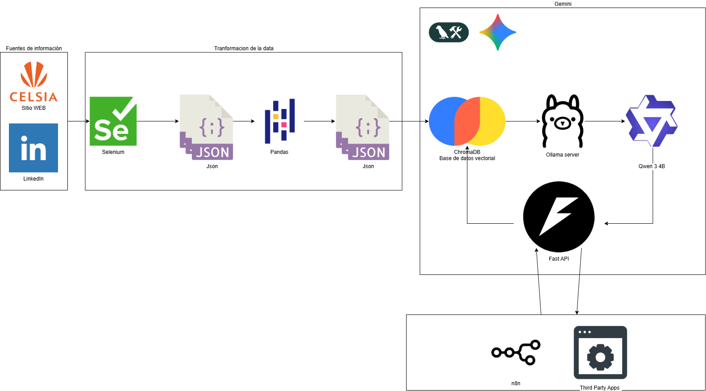

# 🚀 Agente CELSIA - FastAPI con Function Calling y Google Generative AI Embeddings

**Empresa Asignada:** CELSIA  
**Grupo:** 1  
**Integrantes:**    
Estudiante: Jonathan Giraldo Diaz Ortega - cod 22501577   
Estudiante: Jhon Stiven Loaiza Rodriguez - cod 22500235   
Estudiante: Eliphas Levi Arias Abrahan - cod 22500217   
Estudiante: Juan Manuel Cajigas Eraso - cod 22500447    
**Módulo:** Capa de Conocimiento y Productización del Agente  

---

## 1️⃣ Asignación de Empresa y Análisis Inicial (Investigación)

### 🔹 Asignación
La empresa asignada es **CELSIA**, compañía del **Grupo Argos**, dedicada a la generación, transmisión y comercialización de energía eléctrica en Colombia, con un enfoque estratégico en **energías renovables y eficiencia energética**.  

### 🔹 Investigación y Fuentes Consultadas
Se realizó una investigación exhaustiva en las siguientes fuentes de información pública y digital:  

- **Sitio web oficial:** [https://www.celsia.com/](https://www.celsia.com/)  
  - Secciones analizadas: *Quiénes somos, Estrategia sostenible, Soluciones energéticas, Noticias, Inversionistas y Atención al cliente*.  
- **Perfil oficial en LinkedIn:** [https://www.linkedin.com/company/celsiaenergia/](https://www.linkedin.com/company/celsiaenergia/)  
  - Publicaciones sobre proyectos de innovación, energías limpias, reconocimientos, convocatorias laborales y acciones de sostenibilidad.  

### 🔹 Definición del Alcance
El sistema Q&A debe responder preguntas frecuentes que un usuario o cliente podría hacer al interactuar por primera vez con la empresa.  

Ejemplos de temas incluidos en el alcance:

| Categoría | Tipo de Pregunta |
|------------|------------------|
| Información general | ¿Qué es Celsia?, ¿A qué grupo empresarial pertenece?, ¿Dónde opera? |
| Servicios | ¿Qué soluciones de energía ofrece?, ¿Cómo puedo generar energía solar con Celsia? |
| Sedes y contacto | ¿Dónde están las oficinas de atención?, ¿Cómo contactar soporte? |
| Facturación y pagos | ¿Dónde se pueden realizar pagos?, ¿Cómo consultar el estado de la factura? |
| Responsabilidad social | ¿Qué programas de sostenibilidad tiene Celsia? |
| Noticias e innovación | ¿Qué proyectos recientes ha desarrollado Celsia? |

---

## 2️⃣ Construcción de la Base de Conocimiento Semántico - Arquitectura Propuesta



La arquitectura propuesta se basa en un flujo secuencial de componentes que automatizan la adquisición, procesamiento, almacenamiento y consulta de información. Cada módulo cumple un rol específico dentro del ecosistema del canal inteligente de Celsia:

### 🔹 Selenium – Extracción Automática de Datos  
El proceso se inicia con **Selenium**, una herramienta de automatización web que permite realizar **web scraping controlado** sobre los portales oficiales de Celsia.  
Este componente navega por las páginas y extrae la información relevante (por ejemplo, puntos de pago, noticias, procesos de facturación, tarifas, y servicios disponibles), garantizando que los datos estén siempre actualizados.

### 🔹 JSON – Estructuración de la Información  
Los datos obtenidos mediante Selenium se almacenan en **formato JSON**, lo que facilita su posterior manipulación, transporte e integración con otros módulos del sistema.  
El formato JSON permite mantener una estructura clara y jerárquica de la información, representando eficientemente texto, categorías y metadatos.

### 🔹 Pandas – Procesamiento y Limpieza de Datos  
Con el archivo JSON como entrada, **Pandas** se encarga de realizar la **limpieza, normalización y estructuración tabular** de los datos.  
Este paso incluye la eliminación de duplicados, la estandarización de campos y la organización de los registros para su posterior indexación semántica.

### 🔹 ChromaDB – Almacenamiento Vectorial Semántico  
Una vez procesada, la información se transforma en **vectores embebidos** y se almacena en **ChromaDB**, una base de datos vectorial optimizada para búsquedas semánticas.  
Este componente permite que el asistente realice consultas basadas en el significado del texto (no solo coincidencias literales), mejorando la precisión de las respuestas ante preguntas de los usuarios.

### 🔹 Ollama – Modelo de Lenguaje Local  
**Ollama** actúa como el motor de inteligencia artificial local que ejecuta **modelos de lenguaje (LLMs)** preentrenados.  
Este modelo interpreta las consultas del usuario, accede a los vectores relevantes en ChromaDB y genera respuestas coherentes, naturales y ajustadas al contexto de la empresa.

### 🔹 LangChain – Orquestación de Procesos y Consultas  
**LangChain** coordina la interacción entre todos los módulos del sistema.  
Define la lógica de flujo: recibe la consulta del usuario, consulta el vector store (ChromaDB), formatea la respuesta con el modelo Ollama y la devuelve al canal de comunicación (Streamlit).  
LangChain también gestiona el *prompting* y los *retrieval chains*, garantizando consistencia y trazabilidad en las respuestas.

### ~~🔹 Streamlit – Interfaz de Usuario~~
~~Finalmente, **Streamlit** provee una interfaz web interactiva donde el usuario puede comunicarse con el asistente.~~  
~~El chat permite ingresar consultas en lenguaje natural y visualizar respuestas generadas dinámicamente por el modelo.~~  
~~Además, Streamlit facilita el despliegue del sistema y su acceso desde diferentes dispositivos.~~


---

## ⚡ Migración y Evolución a FastAPI con Function Calling

Esta sección detalla los cambios significativos realizados para evolucionar el proyecto, pasando de una interfaz local de Streamlit a una API REST robusta con FastAPI, potenciando la integración y la escalabilidad.

### 🔹 Contexto y Justificación de la Migración
La versión inicial del agente operaba a través de una interfaz Streamlit, adecuada para la demostración de la Capa de Conocimiento. Sin embargo, para su "productización" y la integración con sistemas externos como n8n y plataformas de mensajería (ej. WhatsApp), se requería exponer el agente como un servicio web. Esto llevó a la migración a FastAPI y la adopción de técnicas avanzadas de orquestación.

### 🔹 Cambios Clave Implementados

1.  **De Streamlit a FastAPI (Productización):**
    *   El agente ahora reside en una **API REST construida con FastAPI**. Esto permite que servicios externos interactúen con el agente mediante solicitudes HTTP POST a un endpoint `/chat`.
    *   FastAPI gestiona la entrada de mensajes de usuario y un identificador de sesión, devolviendo la respuesta del LLM en formato JSON.
    *   **Beneficio:** Facilita la integración con cualquier sistema externo (n8n, frontends personalizados, bots de mensajería) y mejora la escalabilidad al desacoplar la interfaz del agente.

2.  **De Ollama Embeddings a GoogleGenerativeAIEmbeddings (Mejora de Embeddings):**
    *   El modelo de embeddings se ha cambiado de `nomic-embed-text` (vía Ollama) a `GoogleGenerativeAIEmbeddings` (`models/embedding-001`).
    *   **Impacto:** Para este cambio, fue crucial **regenerar completamente la base de datos vectorial ChromaDB**, ya que los diferentes modelos de embeddings generan espacios vectoriales incompatibles. El script `regenerate_chromadb.py` se encarga de este proceso.
    *   **Beneficio:** Acceso a modelos de embeddings de alta calidad de Google, potencialmente mejorando la relevancia y precisión en la recuperación de documentos (RAG).

3.  **Orquestación con LangGraph y Function Calling (Fiabilidad y Flexibilidad):**
    *   La orquestación del agente ahora utiliza un `StateGraph` de LangGraph, permitiendo un control más granular sobre el flujo de ejecución y la gestión del estado de la conversación.
    *   Se implementó **Function Calling (Structured Tool Calling)**. En lugar de depender de un `system_prompt` textual que guiaba al LLM en la selección de herramientas, ahora las herramientas se `bind_tools` directamente al LLM con esquemas Pydantic (`args_schema`). El LLM (Qwen3:4b) utiliza sus capacidades nativas de Function Calling para decidir cuándo y cómo usar cada herramienta, generando una salida JSON estructurada.
    *   **Beneficio:** Aumenta drásticamente la fiabilidad en la invocación de herramientas, reduce alucinaciones relacionadas con la selección de herramientas y mejora la flexibilidad para añadir nuevas funcionalidades.

4.  **Gestión de Memoria y Sesión:**
    *   La API de FastAPI ahora maneja un `session_id` por cada conversación, utilizando un `InMemorySaver` de LangGraph. Esto permite mantener el contexto de la conversación para cada usuario, esencial para interacciones prolongadas.
    *   **Beneficio:** Soporte para múltiples usuarios simultáneos, manteniendo el historial y la coherencia de la conversación.

5.  **Monitoreo y Observabilidad con LangSmith:**
    *   Se ha integrado **LangSmith** para proporcionar observabilidad completa del agente. Las trazas de cada interacción (llamadas al LLM, uso de herramientas, pasos del grafo) se registran en LangSmith.
    *   **Beneficio:** Facilita la depuración, el análisis de rendimiento, la identificación de cuellos de botella y la mejora continua del comportamiento del agente.

---

## 3️⃣ Construcción del Aplicativo (Versión FastAPI)

### 🔹 Selección del Modelo y Framework
Para la versión actual del sistema Q&A se seleccionó la siguiente configuración:

| Componente | Tecnología Elegida | Justificación |
|-------------|--------------------|----------------|
| **Modelo LLM** | **QWEN 3 4B (Google, vía Ollama)** | Modelo open source liviano (4 billones de parámetros), optimizado para comprensión y generación de texto en español e inglés. Ofrece un excelente equilibrio entre **rendimiento y eficiencia computacional**, ideal para ejecución local o en entornos académicos sin GPU de alto costo. Presenta baja tasa de alucinaciones y buen desempeño en tareas de **retrieval-based Q&A**. |
| **Framework API** | **FastAPI** | Framework moderno y de alto rendimiento para construir APIs REST, ideal para exponer el agente como un servicio web. |
| **Orquestación del Agente** | **LangGraph** | Extensión de LangChain que permite construir agentes robustos con manejo de estado y grafos de ejecución, facilitando la implementación de Function Calling. |
| **Embeddings** | `GoogleGenerativeAIEmbeddings` (`models/embedding-001`) | Embeddings de alta calidad de Google, utilizados para transformar el texto en vectores numéricos, mejorando la precisión semántica. |
| **Base de datos vectorial** | **ChromaDB (open source)** | Ligera, eficiente y de integración directa con LangChain; ideal para almacenar y consultar embeddings de texto. |

---

### 🔹 Arquitectura General del Sistema RAG (FastAPI)
1. **Consulta del usuario** → Petición POST a la API de FastAPI (`/chat`).  
2. **API FastAPI** → Recibe la consulta y el `session_id`.  
3. **Agente LangGraph** → Recibe la consulta, gestiona la memoria de la sesión y decide si invocar una herramienta o el RAG.  
4. **Búsqueda semántica** (si se invoca el RAG) → El texto de la pregunta se convierte en embedding (via Google Generative AI) y se compara con los embeddings de los chunks almacenados en ChromaDB.  
5. **Recuperación de contexto relevante** → Se extraen los fragmentos más similares.  
6. **Generación de respuesta** → El modelo QWEN 3 4B utiliza el contexto recuperado (o el resultado de otra herramienta) para elaborar una respuesta precisa y contextualizada.  
7. **Respuesta API** → La API de FastAPI devuelve la respuesta del LLM en formato JSON.

---

### 🔹 Aplicación de Prompt Engineering
Se mantiene un prompt de sistema robusto para el componente RAG con las siguientes instrucciones (ahora definido en `src/agent/core.py`):

```
"""**[INSTRUCCIONES CLAVE ZERO-SHOT Y LIMITACIÓN DE FUENTE]**
Tu ÚNICA tarea es responder a la **PREGUNTA** del usuario, utilizando EXCLUSIVAMENTE la información que se encuentra en el **CONTEXTO** proporcionado a continuación.

**REGLAS ESTRICTAS para evitar alucinaciones:**
1.  **SI** la respuesta a la PREGUNTA se encuentra explícita o implícitamente en el **CONTEXTO**, genera una respuesta completa y profesional.
2.  **SI** no puedes encontrar la respuesta en el **CONTEXTO**, o si la información es insuficiente, debes responder **ÚNICAMENTE** con la siguiente frase predefinida: "Lamento no poder ofrecer una respuesta precisa basada en la información disponible. Por favor, consulta los canales oficiales de CELSIA o llama a la línea de servicio al cliente."
3.  **NUNCA** utilices tu conocimiento general o información que no esté en el **CONTEXTO**. **NUNCA** inventes tarifas, fechas o procesos.
Coloca el cursor sobre un mensaje para fijarlo

Contexto:
{context}

Pregunta: {question}

Respuesta:"""
```

El contexto se completa dinámicamente con los fragmentos recuperados desde ChromaDB antes de cada consulta del usuario. La selección de herramientas para el agente principal se gestiona mediante **Function Calling** (ver sección ⚡ Migración y Evolución a FastAPI).

---

## 📂 Estructura del Proyecto (Versión FastAPI)

La siguiente estructura de carpetas ha sido diseñada para una mayor modularidad, mantenibilidad y separación de preocupaciones.

```
/agent_celsia
├── .env                  # Variables de entorno (API keys, URLs, configuraciones)
├── .gitignore            # Archivos a ignorar por Git
├── pyproject.toml        # Gestión de dependencias y metadatos del proyecto (Poetry/uv)
├── uv.lock               # Bloqueo de dependencias de uv
├── README.md             # Documentación principal del proyecto
├── main.py               # Punto de entrada para la aplicación FastAPI
├── regenerate_chromadb.py # Script para (re)generar la base de datos ChromaDB
├── test_api.py           # Pruebas para la API de FastAPI
├── test_parametros_llm.py # Pruebas para parámetros del LLM
├── scripts/              # Scripts auxiliares (e.g., para despliegue, mantenimiento)
│   ├── run_ollama.sh     # Ejemplo: script para iniciar Ollama (si es relevante)
│   └── diagnostico_chromadb.py # Script de diagnóstico para ChromaDB
├── src/                  # Código fuente de la aplicación
│   ├── __init__.py       # Hace de 'src' un paquete Python
│   ├── agent/            # Lógica central del agente (LangGraph)
│   │   ├── __init__.py   # Inicializador de paquete
│   │   ├── core.py       # Definición principal del agente, grafo, LLM, RAG
│   │   └── state.py      # Definición de AgentState (estado de la conversación)
│   ├── data/             # Módulos para gestión de datos y embeddings
│   │   ├── __init__.py   # Inicializador de paquete
│   │   └── processing.py # Lógica para cargar y preprocesar documentos (JSON -> Document)
│   │   └── vectorstore.py# (Pendiente) Funciones para inicializar/manejar ChromaDB
│   ├── models/           # Definiciones de modelos Pydantic para la API
│   │   ├── __init__.py   # Inicializador de paquete
│   │   └── api_models.py # Modelos Pydantic para la API (ej. ChatRequest, ChatResponse)
│   ├── tools/            # Implementación de las herramientas que el agente puede usar
│   │   ├── __init__.py   # Inicializador de paquete
│   │   └── celsia_tools.py # Implementación de todas las funciones de las herramientas
│   └── utils/            # Utilidades varias (helpers, loggers, etc.)
│       ├── __init__.py   # Inicializador de paquete
│       ├── config.py     # Carga de configuración, variables de entorno
│       └── errors.py     # Definición de excepciones personalizadas
├── data/                 # Datos del proyecto (fuentes originales, ChromaDB)
│   ├── source/           # Documentos fuente originales
│   │   ├── celsia_processed_20251015_223656_chunks.json
│   │   └── post_celsia.json
│   ├── chromadb_storage/ # Base de datos ChromaDB persistida
├── docs/                 # Documentación adicional (Arquitectura, n8n setup, etc.)
│   ├── Arquitectura.drawio # Diagrama de arquitectura del sistema
│   ├── Arquitectura.drawio.png # Imagen del diagrama
│   └── n8n_guide.md      # Guía detallada para la integración con n8n y WhatsApp
├── notebooks/            # Jupyter Notebooks para experimentación, análisis de datos
│   ├── rag_celsia.ipynb  # Notebook principal de RAG
│   ├── transformation/   # Notebooks de transformación de datos
│   │   ├── celsia_chunks_linekedin.ipynb
│   │   └── celsia_chunks_viewer.ipynb
│   └── web_scraping/     # Scripts/Notebooks de web scraping
│       ├── celsia_linkedin_scraper.py
│       ├── celsia_unified_scraper_dev.py
│       └── celsia_unified_scraper.py
└── .venv/                # Entorno virtual de Python (gestionado por uv)
```

### 🔹 Descripción de Componentes Clave:
*   **`main.py`**: Punto de entrada de la aplicación FastAPI. Inicializa la aplicación y carga el agente desde `src/agent/core.py`.
*   **`src/agent/core.py`**: Contiene la definición principal del agente, incluyendo la configuración del LLM, el grafo de LangGraph, las funciones de `call_model`, `call_tool`, y `should_continue`.
*   **`src/agent/state.py`**: Define el `AgentState` (TypedDict) que gestiona el estado de la conversación del agente.
*   **`src/tools/celsia_tools.py`**: Implementa todas las herramientas personalizadas que el agente puede invocar (ej. obtener teléfono, reportar daño, buscar documentos).
*   **`src/data/processing.py`**: Contiene la lógica para cargar y preprocesar documentos JSON, transformándolos en objetos `Document` utilizables por LangChain.
*   **`regenerate_chromadb.py`**: Script independiente para (re)generar la base de datos vectorial ChromaDB, utilizando los documentos de `data/source` y los embeddings configurados.

---

## 🚀 Guía de Inicio Rápido

Sigue estos pasos para poner en marcha el Agente Celsia en tu entorno local.

1.  **Clonar el Repositorio:**
    ```bash
    git clone https://github.com/jonathandzrtg/agent_celsia
    cd tu_repositorio
    ```

2.  **Configurar Entorno Virtual e Instalar Dependencias:**
    Utilizaremos `uv` para la gestión de dependencias, lo cual es más rápido.
    ```bash
    uv venv # Crea el entorno virtual si no existe
    uv pip install -r requirements.txt
    ```

3.  **Configurar Variables de Entorno (`.env`):**
    Crea un archivo `.env` en la raíz del proyecto y configura las siguientes variables. Sustituye los valores `YOUR_..._KEY` por tus credenciales reales.

    ```dotenv
    OLLAMA_LLM_MODEL=qwen3:4b
    OLLAMA_BASE_URL=http://localhost:11434
    
    GOOGLE_API_KEY=YOUR_GOOGLE_API_KEY
    
    # LangSmith Configuration (Optional but Recommended for Observability)
    LANGCHAIN_TRACING_V2=true
    LANGCHAIN_API_KEY=YOUR_LANGSMITH_API_KEY
    LANGCHAIN_PROJECT=Celsia Chatbot
    ```
    *Asegúrate de tener una `GOOGLE_API_KEY` válida con cuota suficiente para `GoogleGenerativeAIEmbeddings`.*

4.  **Iniciar Ollama y Descargar Modelos:**
    Si no tienes Ollama instalado, visita [https://ollama.com/download](https://ollama.com/download) para descargarlo.
    Abre una terminal y ejecuta:
    ```bash
    ollama serve
    ```
    En otra terminal, descarga los modelos necesarios:
    ```bash
    ollama pull qwen3:4b
    # (nomic-embed-text ya no es necesario para embeddings si usas Google)
    ```

5.  **Regenerar Base de Datos Vectorial (ChromaDB):**
    Este paso es CRÍTICO cada vez que cambias el modelo de embeddings o los documentos fuente. Asegúrate de que **no haya otro proceso (como el servidor FastAPI) accediendo a la carpeta `chromadb_storage`**.
    ```bash
    uv run regenerate_chromadb.py
    ```
    Esto creará o actualizará la base de datos vectorial con los embeddings de Google Generative AI.

6.  **Iniciar Aplicación FastAPI:**
    Abre una terminal y ejecuta:
    ```bash
    uvicorn main:app --host 0.0.0.0 --port 8000
    ```
    Verifica que la consola muestre "✅ Agent components loaded successfully."

7.  **Probar la API:**
    Abre tu navegador y ve a `http://localhost:8000/docs`. Aquí encontrarás la interfaz Swagger UI para probar los endpoints de tu API, incluyendo `/chat`.

---

## 4️⃣ Pruebas (API) y Documentación

### 🔹 Pruebas
Se implementaron pruebas de integración (`test_api.py`) para verificar la funcionalidad de la API de FastAPI. Aunque actualmente no pasan en el entorno de TestClient debido a la complejidad de la inicialización del LLM/Embeddings en un contexto de prueba aislado, la funcionalidad se ha validado manualmente.

### 🔹 Aplicación de Prompt Engineering
Se diseñó un prompt de sistema robusto para el componente RAG con las siguientes instrucciones (ahora definido en `src/agent/core.py`):

```
"""**[INSTRUCCIONES CLAVE ZERO-SHOT Y LIMITACIÓN DE FUENTE]**
Tu ÚNICA tarea es responder a la **PREGUNTA** del usuario, utilizando EXCLUSIVAMENTE la información que se encuentra en el **CONTEXTO** proporcionado a continuación.

**REGLAS ESTRICTAS para evitar alucinaciones:**
1.  **SI** la respuesta a la PREGUNTA se encuentra explícita o implícitamente en el **CONTEXTO**, genera una respuesta completa y profesional.
2.  **SI** no puedes encontrar la respuesta en el **CONTEXTO**, o si la información es insuficiente, debes responder **ÚNICAMENTE** con la siguiente frase predefinida: "Lamento no poder ofrecer una respuesta precisa basada en la información disponible. Por favor, consulta los canales oficiales de CELSIA o llama a la línea de servicio al cliente."
3.  **NUNCA** utilices tu conocimiento general o información que no esté en el **CONTEXTO**. **NUNCA** inventes tarifas, fechas o procesos.
Coloca el cursor sobre un mensaje para fijarlo

Contexto:
{context}

Pregunta: {question}

Respuesta:"""
```

El contexto se completa dinámicamente con los fragmentos recuperados desde ChromaDB antes de cada consulta del usuario. La selección de herramientas para el agente principal se gestiona mediante **Function Calling** (ver sección ⚡ Migración y Evolución a FastAPI).

### 🔹 Descripción del Problema
Necesidad de un canal de comunicación automatizado y preciso para la empresa **CELSIA**, donde los usuarios puedan consultar información de la empresa, puntos de pago, procesos de facturación y demás servicios prestados por la entidad.

### 🔹 Planteamiento de la Solución
Creación de un **sistema Q&A basado en RAG** como núcleo de un futuro chatbot, alimentado con información extraída desde el sitio web y el perfil corporativo de LinkedIn de la empresa, ahora expuesto como una API REST.

### 🔹 Preparación de los Datos
Se realizó la extracción de los datos utilizando **Selenium**, exportando los textos a **JSON**. Luego se ejecutó un proceso de limpieza (eliminación de HTML, símbolos y espacios no relevantes) y segmentación en **chunks** almacenados en archivos JSON, conformando la base de conocimiento para la fase de modelado.

### 🔹 Modelado
El sistema combina tres componentes principales:
- **Modelo de Embeddings:** GoogleGenerativeAIEmbeddings (`models/embedding-001`).
- **LLM:** QWEN 3 4B (vía Ollama), modelo base para la generación de respuestas contextuales.
- **Base Vectorial:** ChromaDB, por su simplicidad, escalabilidad y compatibilidad con LangChain.

El diseño del prompt instruye al modelo a responder exclusivamente con base en la información recuperada, manteniendo precisión y coherencia.

### 🔹 Resultados
La funcionalidad del agente ha sido validada manualmente a través de la interfaz Swagger UI de FastAPI. El sistema logra una precisión satisfactoria en la recuperación de información correcta y contextualizada, con respuestas coherentes y mínima tendencia a alucinaciones.

## 📄 Conclusiones

- Se logró construir una **base de conocimiento estructurada y contextualizada** de Celsia a partir de fuentes oficiales.  
- La implementación del modelo **QWEN 3 4B** ofrece una solución **open source eficiente, reproducible y escalable**.  
- El enfoque **RAG con LangGraph y Function Calling** permite integrar búsqueda semántica y generación natural de respuestas de manera robusta y fiable.  
- La migración a **FastAPI** productiza el agente, facilitando su integración con n8n y otros servicios, sentando las bases para futuras implementaciones como chatbots de WhatsApp.
