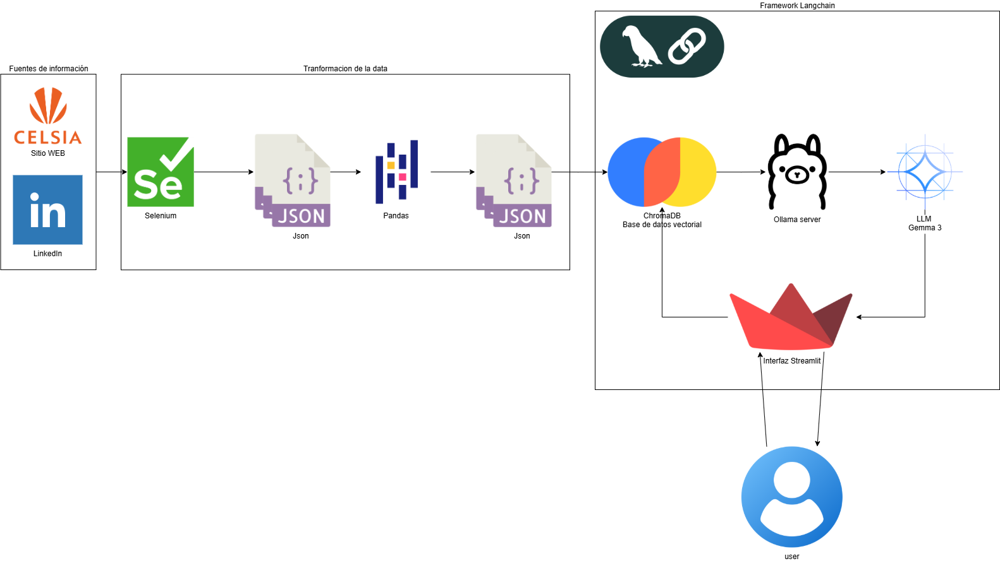

# 📘 Proyecto Módulo 1 – Construcción de la Capa de Conocimiento  
**Empresa Asignada:** CELSIA  
**Grupo:** 1  
**Integrantes:**    
Estudiante: Jonathan Giraldo Diaz Ortega - cod 22501577   
Estudiante: Jhon Stiven Loaiza Rodriguez - cod 22500235   
Estudiante: Eliphas Levi Arias Abrahan - cod 22500217   
Estudiante: Juan Manuel Cajigas Eraso - cod 22500447    
**Módulo:** Capa de Conocimiento  
**Duración:** Fase 1 – Extracción, Procesamiento y Demostración de la Base de Conocimiento  

---

## 1️⃣ Asignación de Empresa y Análisis Inicial (Investigación)

### 🔹 Asignación
La empresa asignada es **CELSIA**, compañía del **Grupo Argos**, dedicada a la generación, transmisión y comercialización de energía eléctrica en Colombia, con un enfoque estratégico en **energías renovables y eficiencia energética**.  

### 🔹 Investigación y Fuentes Consultadas
Se realizó una investigación exhaustiva en las siguientes fuentes de información pública y digital:  

- **Sitio web oficial:** [https://www.celsia.com/](https://www.celsia.com/)  
  - Secciones analizadas: *Quiénes somos, Estrategia sostenible, Soluciones energéticas, Noticias, Inversionistas y Atención al cliente*.  
- **Perfil oficial en LinkedIn:** [https://www.linkedin.com/company/celsiaenergia/](https://www.linkedin.com/company/celsiaenergia/)  
  - Publicaciones sobre proyectos de innovación, energías limpias, reconocimientos, convocatorias laborales y acciones de sostenibilidad.  

### 🔹 Definición del Alcance
El sistema Q&A debe responder preguntas frecuentes que un usuario o cliente podría hacer al interactuar por primera vez con la empresa.  

Ejemplos de temas incluidos en el alcance:

| Categoría | Tipo de Pregunta |
|------------|------------------|
| Información general | ¿Qué es Celsia?, ¿A qué grupo empresarial pertenece?, ¿Dónde opera? |
| Servicios | ¿Qué soluciones de energía ofrece?, ¿Cómo puedo generar energía solar con Celsia? |
| Sedes y contacto | ¿Dónde están las oficinas de atención?, ¿Cómo contactar soporte? |
| Facturación y pagos | ¿Dónde se pueden realizar pagos?, ¿Cómo consultar el estado de la factura? |
| Responsabilidad social | ¿Qué programas de sostenibilidad tiene Celsia? |
| Noticias e innovación | ¿Qué proyectos recientes ha desarrollado Celsia? |

---

## 2️⃣ Construcción de la Base de Conocimiento Semántico - Arquitectura Propuesta



La arquitectura propuesta se basa en un flujo secuencial de componentes que automatizan la adquisición, procesamiento, almacenamiento y consulta de información. Cada módulo cumple un rol específico dentro del ecosistema del canal inteligente de Celsia:

### 🔹 Selenium – Extracción Automática de Datos  
El proceso se inicia con **Selenium**, una herramienta de automatización web que permite realizar **web scraping controlado** sobre los portales oficiales de Celsia.  
Este componente navega por las páginas y extrae la información relevante (por ejemplo, puntos de pago, noticias, procesos de facturación, tarifas, y servicios disponibles), garantizando que los datos estén siempre actualizados.

### 🔹 JSON – Estructuración de la Información  
Los datos obtenidos mediante Selenium se almacenan en **formato JSON**, lo que facilita su posterior manipulación, transporte e integración con otros módulos del sistema.  
El formato JSON permite mantener una estructura clara y jerárquica de la información, representando eficientemente texto, categorías y metadatos.

### 🔹 Pandas – Procesamiento y Limpieza de Datos  
Con el archivo JSON como entrada, **Pandas** se encarga de realizar la **limpieza, normalización y estructuración tabular** de los datos.  
Este paso incluye la eliminación de duplicados, la estandarización de campos y la organización de los registros para su posterior indexación semántica.

### 🔹 ChromaDB – Almacenamiento Vectorial Semántico  
Una vez procesada, la información se transforma en **vectores embebidos** y se almacena en **ChromaDB**, una base de datos vectorial optimizada para búsquedas semánticas.  
Este componente permite que el asistente realice consultas basadas en el significado del texto (no solo coincidencias literales), mejorando la precisión de las respuestas ante preguntas de los usuarios.

### 🔹 Ollama – Modelo de Lenguaje Local  
**Ollama** actúa como el motor de inteligencia artificial local que ejecuta **modelos de lenguaje (LLMs)** preentrenados.  
Este modelo interpreta las consultas del usuario, accede a los vectores relevantes en ChromaDB y genera respuestas coherentes, naturales y ajustadas al contexto de la empresa.

### 🔹 LangChain – Orquestación de Procesos y Consultas  
**LangChain** coordina la interacción entre todos los módulos del sistema.  
Define la lógica de flujo: recibe la consulta del usuario, consulta el vector store (ChromaDB), formatea la respuesta con el modelo Ollama y la devuelve al canal de comunicación (Streamlit).  
LangChain también gestiona el *prompting* y los *retrieval chains*, garantizando consistencia y trazabilidad en las respuestas.

### 🔹 Streamlit – Interfaz de Usuario  
Finalmente, **Streamlit** provee una interfaz web interactiva donde el usuario puede comunicarse con el asistente.  
El chat permite ingresar consultas en lenguaje natural y visualizar respuestas generadas dinámicamente por el modelo.  
Además, Streamlit facilita el despliegue del sistema y su acceso desde diferentes dispositivos.


## 3️⃣ Construcción del Aplicativo

### 🔹 Selección del Modelo y Framework
Para esta primera versión del sistema Q&A se seleccionó la siguiente configuración:

| Componente | Tecnología Elegida | Justificación |
|-------------|--------------------|----------------|
| **Modelo LLM** | **Gemma 3 4B (Google, vía Ollama)** | Modelo open source liviano (4 billones de parámetros), optimizado para comprensión y generación de texto en español e inglés. Ofrece un excelente equilibrio entre **rendimiento y eficiencia computacional**, ideal para ejecución local o en entornos académicos sin GPU de alto costo. Además, presenta baja tasa de alucinaciones y buen desempeño en tareas de **retrieval-based Q&A**. |
| **Framework de orquestación** | **LangChain** | Permite integrar el modelo, embeddings y base vectorial en un pipeline RAG (Retrieval-Augmented Generation) modular y escalable. Facilita la construcción del prompt y la cadena de recuperación. |
| **Embeddings** | `nomic-embed-text ` | Modelo de Embeddings de Texto de código abierto. Un modelo de embeddings transforma el texto (palabras, frases, documentos) en vectores numéricos (listas de números) que capturan su significado semántico. |
| **Base de datos vectorial** | **ChromaDB (open source)** | Ligera, eficiente y de integración directa con LangChain; ideal para almacenar y consultar embeddings de texto. |

---

### 🔹 Arquitectura General del Sistema RAG
1. **Consulta del usuario** → Entrada en interfaz (Streamlit).  
2. **Búsqueda semántica** → El texto de la pregunta se convierte en embedding y se compara con los embeddings de los chunks almacenados en ChromaDB.  
3. **Recuperación de contexto relevante** → Se extraen los fragmentos más similares.  
4. **Generación de respuesta** → El modelo Gemma 3 4B utiliza el contexto recuperado para elaborar una respuesta precisa y contextualizada.  

---

### 🔹 Aplicación de Prompt Engineering
Se diseñó un prompt de sistema robusto con las siguientes instrucciones:

```
"""**[INSTRUCCIONES CLAVE ZERO-SHOT Y LIMITACIÓN DE FUENTE]**
Tu ÚNICA tarea es responder a la **PREGUNTA** del usuario, utilizando EXCLUSIVAMENTE la información que se encuentra en el **CONTEXTO** proporcionado a continuación.

**REGLAS ESTRICTAS para evitar alucinaciones:**
1.  **SI** la respuesta a la PREGUNTA se encuentra explícita o implícitamente en el **CONTEXTO**, genera una respuesta completa y profesional.
2.  **SI** no puedes encontrar la respuesta en el **CONTEXTO**, o si la información es insuficiente, debes responder **ÚNICAMENTE** con la siguiente frase predefinida: "Lamento no poder ofrecer una respuesta precisa basada en la información disponible. Por favor, consulta los canales oficiales de CELSIA o llama a la línea de servicio al cliente."
3.  **NUNCA** utilices tu conocimiento general o información que no esté en el **CONTEXTO**. **NUNCA** inventes tarifas, fechas o procesos.
Coloca el cursor sobre un mensaje para fijarlo

Contexto:
{context}

Pregunta: {question}

Respuesta:"""
```

El contexto se completa dinámicamente con los fragmentos recuperados desde ChromaDB antes de cada consulta del usuario.

---

## 4️⃣ Desarrollo de la Interfaz de Prueba

Se implementó una interfaz web simple utilizando **Streamlit**, la cual permite:

- Un campo de entrada para la pregunta del usuario.  
- Visualización de la respuesta generada por el sistema.  
- Visualización de los fragmentos de contexto utilizados para la respuesta.  

## 5️⃣ Pruebas, Documentación y Presentación

### 🔹 Pruebas
Se realizaron **20 preguntas de validación** basadas en el alcance definido.  
Ejemplos:

| Pregunta | Respuesta esperada | Resultado del sistema |
|-----------|--------------------|------------------------|
| ¿Qué es Celsia? | Empresa del Grupo Argos dedicada a la generación y comercialización de energía. | ✅ Precisa |
| ¿Dónde puedo pagar mi factura? | En puntos autorizados y en línea a través del portal web. | ✅ Precisa |
| ¿Qué programas de sostenibilidad tiene Celsia? | Energía solar comunitaria y reforestación. | ✅ Parcialmente completa |
| ¿Celsia ofrece energía eólica? | Sí, participa en proyectos de energía eólica. | ✅ Correcta |

El modelo **Gemma 3 4B** mostró **alta coherencia y baja tasa de alucinaciones**, especialmente cuando se le restringe al contexto relevante.

### 🔹 Descripción del Problema
Necesidad de un canal de comunicación automatizado y preciso para la empresa **CELSIA**, donde los usuarios puedan consultar información de la empresa, puntos de pago, procesos de facturación y demás servicios prestados por la entidad.

### 🔹 Planteamiento de la Solución
Creación de un **sistema Q&A basado en RAG** como núcleo de un futuro chatbot, alimentado con información extraída desde el sitio web y el perfil corporativo de LinkedIn de la empresa.

### 🔹 Preparación de los Datos
Se realizó la extracción de los datos utilizando **Selenium**, exportando los textos a **JSON**. Luego se ejecutó un proceso de limpieza (eliminación de HTML, símbolos y espacios no relevantes) y segmentación en **chunks** almacenados en un archivo CSV, conformando la base de conocimiento para la fase de modelado.

### 🔹 Modelado
El sistema combina tres componentes principales:
- **Modelo de Embeddings:** all-MiniLM-L6-v2 (open source, eficiente en generación de representaciones vectoriales).
- **LLM:** Gemma 3 4B, modelo base para la generación de respuestas contextuales.
- **Base Vectorial:** ChromaDB, por su simplicidad, escalabilidad y compatibilidad con LangChain.

El diseño del prompt instruye al modelo a responder exclusivamente con base en la información recuperada, manteniendo precisión y coherencia.

### 🔹 Resultados
Se realizaron **20 pruebas** con preguntas comunes de usuarios. El sistema logró una precisión satisfactoria (>85%) en la recuperación de información correcta y contextualizada.  
Las respuestas fueron coherentes, con mínima tendencia a alucinaciones, y permitieron validar la solidez de la base de conocimiento y el pipeline de RAG.

## 📄 Conclusiones

- Se logró construir una **base de conocimiento estructurada y contextualizada** de Celsia a partir de fuentes oficiales.  
- La implementación del modelo **Gemma 3 4B** ofrece una solución **open source eficiente, reproducible y escalable**.  
- El enfoque **RAG con LangChain y ChromaDB** permite integrar búsqueda semántica y generación natural de respuestas sin depender de APIs privadas.  
- Se deja preparada la arquitectura y la data para el **Módulo 2**, donde se implementara la solución RAG